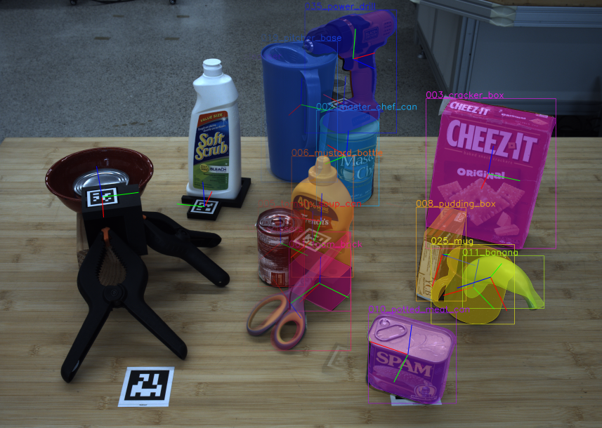

# fixture_generation

This repository contains files and code for the paper **Towards Autonomous Data Annotation and System-Agnostic Robotic Benchmarking with 3D-Printed Fixtures**.

<p align="center">

<p>


If you find this project useful for your research, consider citing
```bibtex
@inproceedings{boerdijk2025fixtures,
  title={Towards Autonomous Data Annotation and System-Agnostic Robotic Benchmarking with 3D-Printed Fixtures},
  author={Boerdijk, Wout and Durner, Maximilian and Sakagami, Ryo and Lehner, Peter and Triebel, Rudolph},
  booktitle={2025 IEEE International Conference on Robotics and Automation (ICRA)},
  year={2025},
  organization={IEEE}
}
```

## Overview

Fixture `.stl` files of all objects and scenes used in the paper can be found [here](fixture_files).

Code is located in `fixture_generation`.

## Generating fixtures

Install [BlenderProc](https://github.com/DLR-RM/BlenderProc) following the installation instructions.
Install this package with e.g. `pip install .` inside its root directory.
Then, use the utility functions located in [fixture_generation](fixture_generation).

### Slider fixtures

```python
import blenderproc as bproc
from fixture_generation.create_fixture_bot_attached import create_fixture_bot_attached

bproc.init()

# load the object
obj = bproc.loader.load_obj("path/to/your/object", forward_axis='X', up_axis='Z')[0]

# additional settings
fixture_height = 0.01  # fixture height in meters
open_side = '+x'  # coordinate axis for the open side; supported are combinations of +/- and x/y
tag_side = '+y'  # same as open_side

# create the fixture
fixture, obj2tag_trafo = create_fixture_bot_attached(obj=obj, fixture_height=fixture_height, open_side=open_side, 
                                                     tag_side=tag_side)
```

### Cylindrical fixtures

```python
import blenderproc as bproc
from fixture_generation.create_fixture_cylinder import create_fixture_cylinder

bproc.init()

# load the object
obj = bproc.loader.load_obj("path/to/your/object", forward_axis='X', up_axis='Z')[0]

# additional settings
xy_dims = ...  # tuple of x and y size in m
xy_loc = ...  # tuple of x and y location in m
height = ...  # float denoting the fixture height
offset = ...  # float denoting the offset

# create the fixture
fixture, obj2tag_trafo = create_fixture_cylinder(obj=obj, fixture_dims=xy_dims, fixture_loc=xy_loc, fixture_height=height,
                                                 offset=offset)
```

### Top-down fixtures

```python
import blenderproc as bproc
from fixture_generation.create_fixture_top_down import create_fixture_top_down

bproc.init()

# load the object
obj = bproc.loader.load_obj("path/to/your/object", forward_axis='X', up_axis='Z')[0]

# additional settings
xy_loc = ...  # tuple of x and y location in m
z_loc = ...  # float of the z location in m
xy_dims = ...  # dimensions of x and y in m
solidify = ...  # solidification in m
add_cube = ...  # boolean indicating whether to add a cube in case the fixture is not larger than the object
postprocess = ...  # boolean indicating whether to perform additional postprocessing for clean-up
tag_border = ...  # boolean indicating whether to add a tag border to the fixture

# create the fixture
fixture, obj2tag_trafo = create_fixture_top_down(obj=obj, fixture_dims=xy_dims, fixture_loc=xy_loc, z_loc=z_loc,
                                                 add_cube=add_cube, solidify=solidify, postprocess=postprocess, 
                                                 tag_border=tag_border)
```
